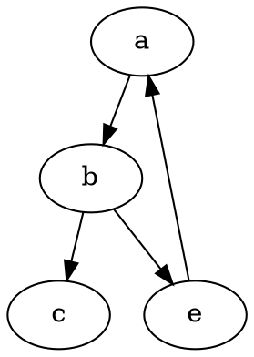

### To Do

- [x] set anchor around season and not around the firs and last observation 
    - this is done since as the anchor is set around monitoring season and not the observations themselves.
- filter out site with no observation during the monitoring season
- add stop and next when no count are available
- add butterfly week count index like in the regionalGAM

$$\ a + b = c $$

